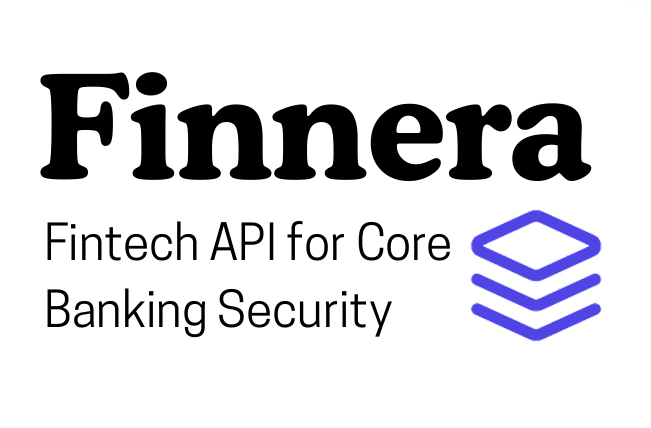
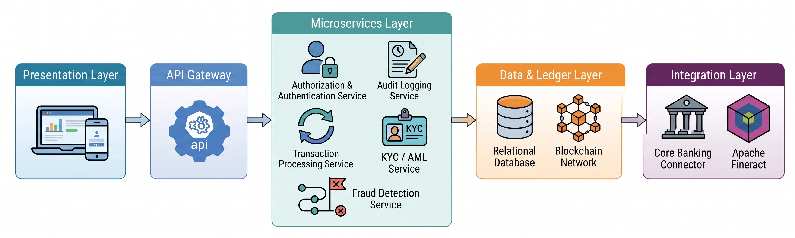

# Finnera – Secure Core Banking & Fintech API Platform

Production-oriented fintech and banking security platform inspired by modern open-banking ecosystems such as Open Bank Project and Apache Fineract.

Finnera is designed as a modular, security-first microservices architecture that demonstrates how modern financial institutions can securely manage digital banking operations, identity, fraud detection, compliance workflows, and audit integrity.

The project combines **Core Banking Integration**, **Zero-Trust Security Principles**, **Blockchain-backed Auditing**, and **AI-assisted Fraud Detection** into a unified banking platform suitable for enterprise-grade financial systems and academic research.



---

# 📌 Project Objectives

The primary goal of Finnera is to design and implement a secure, scalable, and auditable banking platform capable of:

- Providing API-driven banking services through secure microservices.
- Demonstrating modern fintech security architecture patterns.
- Implementing role-based and policy-driven access control.
- Supporting KYC/AML compliance workflows.
- Detecting suspicious financial activities using ML-based fraud scoring.
- Maintaining immutable audit trails using blockchain technology.
- Enabling secure interoperability with core banking systems.

---

# 🏦 Key Features

## 🔐 Identity & Access Management
- OAuth2 / OpenID Connect authentication using Keycloak.
- Multi-Factor Authentication (MFA).
- Role-Based Access Control (RBAC).
- Token validation and centralized authorization policies.
- Secure session and credential lifecycle management.

## 💳 Core Banking Integration
- Secure integration with Apache Fineract.
- API-driven banking operations:
  - Customer onboarding
  - Account management
  - Deposits & withdrawals
  - Fund transfers
  - Loan operations
- Standardized banking request orchestration.

## 🛡️ Fraud Detection & Risk Scoring
- Real-time fraud risk analysis.
- Threshold-based anomaly detection.
- Machine learning fraud scoring service.
- Transaction flagging and alert management.
- Investigation workflow support for compliance teams.

## 📑 KYC / AML Compliance
- Customer onboarding workflows.
- KYC verification pipelines.
- AML screening orchestration.
- Encrypted Personally Identifiable Information (PII).
- Decentralized Identifier (DID) issuance support.

## ⛓️ Immutable Audit & Blockchain Integrity
- Tamper-resistant audit logs.
- Blockchain anchoring through Hyperledger Fabric.
- CouchDB world-state persistence.
- Transaction integrity verification.
- Compliance-ready exportable audit reports.

## 📊 Operational Dashboards
Role-aware dashboards for:
- Super Admin
- Compliance Officer
- Bank Manager
- Loan Officer

Includes:
- Fraud monitoring panels
- Customer management
- Transaction analytics
- Compliance reports
- Audit verification tools

---

# 🏗️ System Architecture

Finnera follows a distributed microservices architecture with independently deployable services.

## Core Modules

| Module | Description |
|---|---|
| `api-gateway` | Centralized routing, rate limiting, request mediation, and API policy enforcement |
| `auth-service` | Identity lifecycle, MFA handling, JWT validation, RBAC |
| `core-banking-connector` | Integration layer over Apache Fineract APIs |
| `transaction-service` | Secure transaction orchestration and maker-checker workflows |
| `fraud-detection-service` | Fraud scoring, anomaly detection, and alerting |
| `audit-service` | Immutable event tracking and blockchain anchoring |
| `kyc-aml-service` | KYC onboarding, AML workflows, DID management |
| `frontend` | React-based operational console and dashboards |
| `fabric-network` | Hyperledger Fabric network and smart contract assets |
| `ml-fraud-model` | AI/ML inference service for fraud prediction |

---



# 🔒 Security Architecture

Finnera adopts a layered security architecture aligned with fintech and banking security practices.

## Security Controls
- Zero-trust service communication
- JWT-based authentication
- OAuth2 token introspection
- RBAC authorization
- API Gateway policy enforcement
- Secure secret handling through environment variables
- Encrypted sensitive customer data
- Immutable blockchain-backed audit records
- Fraud anomaly monitoring
- Maker-checker transaction approval system

---

# 🚀 Getting Started

### Prerequisites

- [Docker Desktop](https://www.docker.com/products/docker-desktop/) with Docker Compose v2
- 8 GB+ RAM free for Docker (first boot builds images and runs MySQL, Keycloak, Fineract, Fabric peers, and ML model)
- **Optional (local development outside Docker):** Java 17+, Maven 3.9+, Node.js 18+
- **Optional (Hyperledger Fabric scripts on the host):** Git Bash or WSL, Java 17+, Fabric CLI binaries — see `fabric-network/bin/README.md`
- **Optional (strict TLS/mTLS):** OpenSSL — see `auth-service/certs/README.md`

### 1. Clone the repository

```bash
git clone https://github.com/rooshanriaz/Finerra-Secure-Core-Banking-System.git
cd Finerra-Secure-Core-Banking-System
```

### 2. Create your local environment file

**Linux / macOS / Git Bash:**

```bash
cp .env.example .env
```

**Windows (PowerShell):**

```powershell
Copy-Item .env.example .env
```

Edit `.env` before starting Docker. For **local development**, set at least:

```env
# Database
MYSQL_ROOT_PASSWORD=rootpassword
MYSQL_USER=fyp_user
MYSQL_PASSWORD=fyp_password

# JWT (minimum 32 characters)
JWT_SECRET=local-dev-change-this-to-a-random-32-plus-char-secret

# Keycloak
KEYCLOAK_ADMIN=admin
KEYCLOAK_ADMIN_PASSWORD=admin
KEYCLOAK_FRONTEND_CLIENT_ID=finnera-web

# OIDC (host URLs — required when using a copied .env)
OIDC_ISSUER_URL=http://localhost:8082
OAUTH2_ISSUER_URI=http://localhost:8090/realms/finnera
OAUTH2_JWK_SET_URI=http://localhost:8090/realms/finnera/protocol/openid-connect/certs
OAUTH2_AUDIENCE=api-gateway

# Disable TLS for local Docker (enable + keystores only for secure overlay)
SERVER_SSL_ENABLED=false
FINERACT_MTLS_ENABLED=false
GATEWAY_SSL_INSECURE_TRUST_MANAGER=true

# Fabric (on-chain audit/DID when network is running)
FABRIC_ENABLED=true
```

Never commit `.env`. For production, replace every `CHANGE_ME_*` value in `.env.example` with strong secrets and follow `PRODUCTION_RUNBOOK.md`.

**Frontend (only if running Vite outside Docker):**

```bash
cp frontend/.env.example frontend/.env.development
```

### 3. Start the platform (Docker — recommended)

From the repository root:

```bash
docker compose up -d --build
```

First startup can take **5–15 minutes** (Keycloak realm import, Fineract Liquibase, service health checks). Watch progress:

```bash
docker compose ps
docker compose logs -f api-gateway
```

### 4. Verify services

**Linux / macOS / Git Bash:**

```bash
curl -fsS http://localhost:8080/actuator/health
curl -fsS http://localhost:8082/actuator/health
curl -fsS http://localhost:8090/realms/finnera/.well-known/openid-configuration
```

**Windows (PowerShell):**

```powershell
Invoke-WebRequest -UseBasicParsing http://localhost:8080/actuator/health
Invoke-WebRequest -UseBasicParsing http://localhost:8082/actuator/health
Invoke-WebRequest -UseBasicParsing http://localhost:8090/realms/finnera/.well-known/openid-configuration
```

Optional smoke test:

```powershell
powershell -ExecutionPolicy Bypass -File .\scripts\production-smoke-test.ps1
```

### 5. Access the application

| Service | URL |
|---------|-----|
| Frontend (SPA) | http://localhost:3001 |
| API Gateway | http://localhost:8080 |
| Auth service | http://localhost:8082 |
| Keycloak admin | http://localhost:8090 |
| Core Banking Connector | http://localhost:8081 |
| KYC/AML service | http://localhost:8083 |
| NADRA mock | http://localhost:8084 |
| Transaction service | http://localhost:8085 |
| Audit service | http://localhost:8086 |
| Fraud detection | http://localhost:8087 |
| ML fraud model | http://localhost:5001 |
| MySQL | localhost:3307 |
| Redis | localhost:6379 |

Default realm users (imported from `docker/keycloak/realm-finnera.json`):

| Username | Password | Role |
|----------|----------|------|
| `admin` | `Admin@2026!` | ADMIN |
| `branch.manager1` | `Branch@2026!` | MANAGER |
| `compliance.officer1` | `Compliance@2026!` | COMPLIANCE_OFFICER |
| `loan.officer1` | `Loan@2026!` | LOAN_OFFICER |

API documentation is available in the UI at `/api-docs`.

### 6. Optional — Hyperledger Fabric network

The main stack works without Fabric (KYC/Audit use mock DIDs). For **on-chain audit and DID anchoring**:

**a) Create the Docker network (once):**

```bash
docker network create fabric-network
```

**b) Install Fabric CLI binaries (once, ~300 MB):**

```bash
cd fabric-network
curl -sSLO https://raw.githubusercontent.com/hyperledger/fabric/main/scripts/install-fabric.sh
chmod +x install-fabric.sh
./install-fabric.sh binary 2.5.0
cd ..
```

On Windows, run the above in **Git Bash** or WSL. See `fabric-network/bin/README.md`.

**c) Start Fabric, join channel, and deploy chaincode:**

```bash
cd fabric-network
./scripts/network.sh up
./scripts/network.sh deploy-all
cd ..
```

**d) Start (or restart) the application stack** so KYC and Audit attach to Fabric:

```bash
docker compose up -d
```

Fabric status:

```bash
cd fabric-network
./scripts/network.sh status
```

### 7. Optional — strict TLS / mTLS mode

Generate PKCS12 keystores under `certs/` (OpenSSL required). Example on Windows with Git for Windows:

```powershell
cd auth-service\certs
bash ./generate-certs.sh
```

Copy generated keystores to the repo-root `certs/` directory as documented in `PRODUCTION_RUNBOOK.md`, set `SERVER_SSL_ENABLED=true` and keystore passwords in `.env`, then:

```bash
docker compose -f docker-compose.yml -f docker-compose.secure.yml up -d --build
```

### 8. Optional — run the frontend locally (without Docker)

```bash
cd frontend
cp .env.example .env.development
npm install
npm run dev
```

Vite dev server: http://localhost:5173 (proxies API and Keycloak per `vite.config.js`).

### 9. Optional — rebuild only the frontend container

After UI changes:

```powershell
powershell -ExecutionPolicy Bypass -File .\scripts\docker-rebuild-frontend.ps1
```

Or:

```bash
docker compose rm -fs frontend
docker compose build --no-cache frontend
docker compose up -d --no-deps frontend
```

### 10. Stop and reset

Stop all services:

```bash
docker compose down
```

Stop Fabric:

```bash
cd fabric-network
./scripts/network.sh down
```

Remove volumes (deletes local DB and Fineract data):

```bash
docker compose down -v
```

### Troubleshooting

| Issue | What to try |
|-------|-------------|
| Services stay `starting` | Wait 5–15 min on first boot; run `docker compose logs <service>` |
| Gateway unhealthy | Ensure MySQL and Keycloak are up: `docker compose ps` |
| Login / OIDC errors | Confirm `.env` uses `http://localhost:8090` OIDC URLs (not `example.internal`) |
| Empty `JWT_SECRET=` in `.env` | Remove the line or set a 32+ character value (empty overrides defaults) |
| Fabric / DID errors | Run `docker network create fabric-network`, then `fabric-network/scripts/network.sh up` |
| `cryptogen` not found | Install binaries per `fabric-network/bin/README.md` |
| Port already in use | Stop conflicting containers or change host ports in `docker-compose.yml` |

---

# 📡 API Capabilities

## Banking Operations
- Customer onboarding
- Account creation
- Deposits & withdrawals
- Inter-account transfers
- Loan management

## Compliance Operations
- KYC verification
- AML screening
- DID issuance
- Risk assessment

## Security Operations
- MFA authentication
- Fraud alerting
- Audit verification
- Blockchain integrity validation

---

# 📂 Repository Structure

```text
finnera/
│
├── api-gateway/
├── auth-service/
├── core-banking-connector/
├── transaction-service/
├── fraud-detection-service/
├── audit-service/
├── kyc-aml-service/
├── frontend/
├── fabric-network/
├── ml-fraud-model/
├── docker-compose.yml
└── README.md
```

---

# 🧪 Testing Strategy

The project includes:
- Unit Testing
- Integration Testing
- API Testing
- Security Validation Testing
- Fraud Simulation Scenarios
- Blockchain Integrity Verification

---

# 📈 Future Enhancements

Potential future improvements include:
- AI-powered behavioral fraud analytics
- Open Banking API standard support
- Real-time transaction streaming
- Kubernetes deployment support
- SIEM integration
- Multi-bank federation support
- Mobile banking client integration
- Advanced risk intelligence dashboards

---

# 🎓 Academic Significance

This Final Year Project demonstrates practical implementation of:
- Secure distributed systems
- Fintech architecture
- Blockchain-integrated auditing
- Identity & access management
- Secure API design
- AI-assisted fraud detection
- Compliance-aware banking workflows

The project bridges academic concepts with real-world enterprise fintech architecture patterns.

---

# 🤝 Contributors

- [Rooshan Riaz](https://github.com/rooshanriaz)
- [Muhammad Shameer Awais](https://github.com/ShameerAwais)
- [Muhammad Yasir Khan](https://github.com/yasirkhan26)

---

# 📄 License

This project is developed for academic and educational purposes as a Final Year Project (FYP).

---

# ⭐ Acknowledgements

Special thanks to:
- Apache Software Foundation
- Apache Fineract
- Hyperledger Fabric
- Keycloak
- Open-source fintech and security communities for architectural inspiration.

